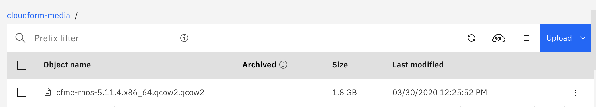
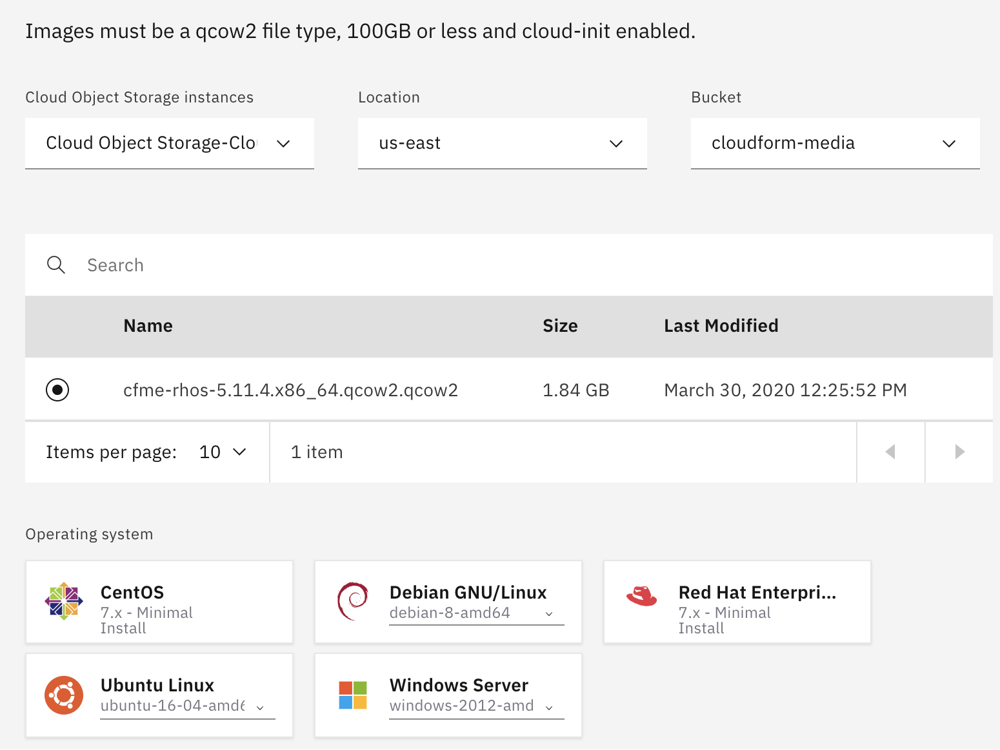

---

copyright:
  years: 2020
lastupdated: "2020-04-20"

keywords: getting started tutorial, getting started, cloudforms

subcollection: cloud-pak-multicloud-management

---

{:shortdesc: .shortdesc}
{:screen: .screen}
{:codeblock: .codeblock}
{:pre: .pre}
{:tip: .tip}
{:note: .note}
{:external: target="_blank" .external}

# Getting started with CloudForms in IBM Cloud
{: #cf-getting-started}

CloudForms delivers the insight, control, and automation enterprises need to address the challenges of managing virtual environments. CloudForms enables enterprises with existing virtual infrastructures to improve visibility and control, and those just starting virtualization deployments to build and operate a well-managed virtual infrastructure. For more information, see the [CloudForms product documentation](https://access.redhat.com/documentation/en-us/red_hat_cloudforms/5.0/).
You can install CloudForms as a virtual appliance in IBM Cloud. 
{:shortdesc}

## Before you begin

- Before you can install CloudForms, you must download the images from [IBM Passport Advantage](https://www.ibm.com/software/passportadvantage/index.html). Download these two part numbers:

| Description                                                                      | File name                               | Passport Advantage part number |
|----------------------------------------------------------------------------------|-----------------------------------------|--------------------------------|
| Red Hat CloudForms 5 for Red Hat OpenStack Platform | cfme-rhos-5.11.4.x86_64.qcow2.qcow2 |   CC5W9EN  |
| Automation navigation for IBM Cloud Pak® for Multicloud Management 1.3 | automation-navigation-updates.sh | CC66KEN  |

- For the list of all part numbers, see [Passport Advantage part numbers](https://www.ibm.com/support/knowledgecenter/en/SSFC4F_1.3.0/about/part_numbers.html).
  
- You must have an IBM Cloud user account with the following roles: 


- You must have {{site.data.keyword.cp4mcm_full_notm}} installed. For more information, see [Getting started with {{site.data.keyword.cp4mcm_full_notm}}](https://test.cloud.ibm.com/docs/cloud-pak-multicloud-management?topic=cloud-pak-multicloud-management-getting-started)  


## Step A. Setting up the Custom image for CloudForms in IBM Cloud
{: #config-image}

Create a custom Linux-based image to deploy CloudForms as a virtual server instance in the IBM Cloud.

1. If you don't already have an instance of IBM Cloud Object Storage, see [Getting started with IBM Cloud Object Storage](https://cloud.ibm.com/docs/services/cloud-object-storage?topic=cloud-object-storage-getting-started)

    Example Cloud Object Storage created:
    

    You must also create a bucket in IBM Cloud Object Storage to store your images.
    Example Standard type bucket created:
    

2. Upload the CloudForms installation image (file name: `cfme-rhos-5.11.4.x86_64.qcow2.qcow2`) to your IBM Cloud Object Storage. Select your bucket and click Add Objects to upload the images. For more information, see [Uploading data by using the console](https://cloud.ibm.com/docs/services/cloud-object-storage?topic=cloud-object-storage-upload#upload-console). **Note:** You can use the Aspera high-speed transfer plug-in to upload images larger than 200 MB.  
Example by using Aspera uploaded file to bucket:


3. From IBM Cloud Identity and Access Management (IAM), create an authorization between the Virtual Private Cloud (VPC) Infrastructure (source service) > Image Service for VPC (resource type) and Cloud Object Storage (target service). For more information, see [Create an authorization](https://cloud.ibm.com/docs/iam?topic=iam-serviceauth#serviceauth).
    
    **Important**: The configuration must be set up as this example or permissions can fail. 
    

4. Create a generation 2 Virtual Private Cloud (**Must be generation 2**). For more information, see [Create a VPC](https://cloud.ibm.com/docs/vpc?topic=vpc-getting-started#create-and-configure-vpc)
  
    a. Create a VPC - The VPC must be in the same resource group and region as your bucket.

    b. Create subnets in one or more zones. You can create subnets in suggested prefix ranges or in your own IP ranges that you bring to IBM Cloud.

    c. Attach a public gateway if you want to allow all resources in a subnet to communicate with the public internet.

    Example VPC: 

5. Configure an access control list (ACL) to limit the subnet's inbound and outbound traffic.

    Example: 


6. Import the CloudForms installation images from the bucket into the VPC.
  
    a. Browse to **VPC Infrastructure** > **Compute** > **Custom images** and select **import custom image**.

    b. Enter a name.

    c. Select a resource group.

    d. Select the region.

    Example:
    

    e. Select your Cloud Object Storage and bucket based on your authorization that is created in step 3.

    f. Select your qcow2 image (custom image).

    g. Select the Red Hat Enterprise for Operating system.

    h. Click **Import custom image**.

    Example:


    Example of custom image listing after successful image creation:


7. Create a virtual server from the custom image by clicking the "three dot menu" of that image, then selecting "New virtual server".

  
   a. Enter your name. Select the Virtual private cloud and Resource group.


   b. Select your region.

   c. Select the custom image that you imported.

   d. Use Memory Profile (2 vcpus, 16 gb ram, 4 gps).

   e. Add an ssh key. You can use a public key. For more information, see: [Locating or generating your SSH key](https://cloud.ibm.com/docs/vpc-on-classic-vsi?topic=vpc-on-classic-vsi-ssh-keys#locating-or-generating-your-ssh-key).

   Example:


    f. Add storage to your virtual service. For example, 100 gigabytes. This volume is needed to configure the CloudForms appliance. 

    **Note:** Make sure that the data volume name is unique and not named the same as another volume across your virtual server instances.

    Example:


    g. Select create virtual server instance. 
 
8. Update the security group that allows inbound and outbound traffic. Open the server instance, go down to the Network interfaces section, and then modify the security group.

    Example:
  

9. Assign the floating IP address:

    Example:


## Step B. Setting up the CloudForms appliance
{: #config-cloudforms-appliance}

1. Use the `ssh` command to connect to your virtual server instance (appliance) by using the floating IP address. Log in with a username of `root` and the default password `smartvm`. The Bash prompt for the root user is displayed.
  
   Example ssh as root user:
   ```
   ssh root@<host_ip_address>
   ```
    

2. Enter the `appliance_console` command. The CloudForms appliance summary screen is displayed.
3. Press Enter to manually configure settings.

    **Note:** Networking is already configured. You can skip this step.

4. Select _5) Configure database_ from the menu.

    - You are prompted to create or fetch an encryption key.
    If this instance is the first CloudForms appliance, select _1) Create key_.
    
    - If this is not the first CloudForms appliance, select _2) Fetch key_ from remote system to fetch the key from the first appliance. For worker and multi-region setups, use this option to copy key from another appliance.

    **Note:** All CloudForms appliances in a multi-region deployment must use the same key.

5. Select _1) Create Internal Database_ for the database location.
6. Choose a disk for the database. This can be either a disk you attached previously, or a partition on the current disk.

    **Important:** Best practice is using a separate disk for the database.
    
    If there is an unpartitioned disk that is attached to the virtual machine, the dialog shows options similar to the following:
    ```
    1) /dev/vdb: 20480
    2) Don't partition the disk
    ```
    - Enter 1 to choose /dev/vdb for the database location. This option creates a logical volume by using this device and mounts the volume to the appliance in a location appropriate for storing the database. The default location is /var/lib/pgsql, which can be found in the environment variable $APPLIANCE_PG_MOUNT_POINT.
    
    - Enter 2 to continue without partitioning the disk. A second prompt confirms this choice. Selecting this option results in using the root file system for the data directory (not advised in most cases).

7. Enter N for "Should this appliance run as a stand-alone database server?"
    - Select N to configure the appliance with the full administrative user interface.

8. When prompted, enter a unique number (01-99) to create a new region.

    **Important:** Creating a new region destroys any existing data on the chosen database.

9. Create and confirm a password for the database.

    CloudForms configures the internal database. This takes a few minutes. 

10. Once CloudForms is installed, you can log in and complete administrative tasks.
    - Log in to Red Hat CloudForms for the first time by:
    - Navigate to the URL for the login screen. For example,  `https://xx.xx.xx.xx` on the virtual server instance, where `xx.xx.xx.xx` is the floating IP.
    - Enter the default credentials (Username: admin | Password: smartvm) for the initial login.
    - Click Login.
  
    For more information, see: [Configuring CloudForms](https://access.redhat.com/documentation/en-us/red_hat_cloudforms/5.0/html/installing_red_hat_cloudforms_on_red_hat_openstack_platform/configuring-cloudforms)


## Step C. Integrating CloudForms with IBM Cloud Pak​​ for Multicloud Management
{: #integrate-cloudforms-cp4mcm}

Enable navigation to CloudForms within the IBM Cloud Pak® console.

Complete the following steps on a Linux system. You can use the boot node from the HUB cluster where IBM Cloud Pak​​ for Multicloud Management is installed. These steps enable navigation to CloudForms from the IBM Cloud Pak​​ console:

1. Obtain the Automation navigation for IBM Cloud Pak​​ for Multicloud Management 1.3 script, `automation-navigation-updates.sh`, from [IBM Passport Advantage®](https://www-01.ibm.com/software/passportadvantage/) website. This script was downloaded from IBM Passport Advantage in the "Before you begin" section.

2. Install and authenticate `kubectl`. For more information, see [Installing the Kubernetes CLI (kubectl)](https://www.ibm.com/support/knowledgecenter/SSFC4F_1.3.0/kubectl/install_kubectl.html).

3. Install JQ. For more information, see [Download jq](https://stedolan.github.io/jq/download/).

4. Copy the `automation-navigation-updates.sh` script to a directory location. Set the file permissions on the script and run the script to enable navigation to your CloudForms instance:

   ```
   chmod 755 ./automation-navigation-updates.sh

   ./automation-navigation-updates.sh -c <CloudForms URL>
   ```
     
   * `-c` Is a required parameter that refers to the URL for the CloudForms console. For example, `https://vm17-cf-test.ibm.com/#/`

5. Verify that the CloudForms instance is in the IBM Cloud Pak​​ console navigation menu. From the IBM Cloud Pak​​ navigation menu, click **Automate infrastructure** > **CloudForms**.

CloudForms is integrated with the IBM Cloud Pak​​ console.


## Step D. Enable Single Sign-on with CloudForms and IBM Cloud Pak​​ for Multicloud Management
{: #sso-cloudforms-cp4mcm}

CloudForms enables single sign-on integration with an enterprise identity provider through use of the OpenID Connect (OIDC). Complete the single sign-on integration between IBM Cloud Pak​​ for Multicloud Management and CloudForms by completing these steps:
1. Register the CloudForms OIDC client with IAM. These steps are completed on the IBM Cloud Pak for Multicloud Management cluster.
2. Configure CloudForms to enable OIDC authentication with the same identity provider used for IBM Cloud Pak for Multicloud Management. These steps are completed on the CloudForms appliance.

### Step 1. Register CloudForms instance with IAM as an OIDC client 
{: #register-cf-with-IAM-as-OIDC-client}

In order to enable SSO between IBM Cloud Pak​​ for Multicloud Management and CloudForms using OIDC, the CloudForms instance needs to register as an OIDC client with Identity and Access Management (IAM). Complete these steps on the IBM Cloud Pak for Multicloud Management cluster.

There are two ways to register CloudForms as an OIDC client with IAM. One is through the `cloudctl` command and the other is by calling the IAM API directly.

Both of these methods require the following registration payload in a file "registration.json":

```
{
  "token_endpoint_auth_method":"client_secret_basic",
  "client_id": "<CLIENT_ID>",
  "client_secret": "<CLIENT_SECRET>",
  "scope":"openid profile email",
  "grant_types":[
     "authorization_code",
     "client_credentials",
     "password",
     "implicit",
     "refresh_token",
     "urn:ietf:params:oauth:grant-type:jwt-bearer"
  ],
  "response_types":[
     "code",
     "token",
     "id_token token"
  ],
  "application_type":"web",
  "subject_type":"public",
  "post_logout_redirect_uris":[
     "https://<CP4MCM_CONSOLE_URL>"   ],
  "preauthorized_scope":"openid profile email general",
  "introspect_tokens":true,
  "trusted_uri_prefixes":[
     "https://<CP4MCM_CONSOLE_URL>/"    ],
  "redirect_uris":["https://<CP4MCM_CONSOLE_URL>/auth/liberty/callback","https://<CLOUDFORMS_URL>/oidc_login/redirect_uri"]
  }
  ```
  {: codeblock}

  Example registration payload (for reference only):
  ```
  {
 "token_endpoint_auth_method":"client_secret_basic",
 "client_id": "N3NzNVFsSjlLVkl6Zk5hZ01MRzJVaVdnbFcxNGl5cnQK",
 "client_secret": "VWNVNzF4ZUxNSVBQUHZHdG1xQmNsTTFOWmNUUGlnYUkK",
 "scope":"openid profile email",
 "grant_types":[
    "authorization_code",
    "client_credentials",
    "password",
    "implicit",
    "refresh_token",
    "urn:ietf:params:oauth:grant-type:jwt-bearer"
 ],
 "response_types":[
    "code",
    "token",
    "id_token token"
 ],
 "application_type":"web",
 "subject_type":"public",
 "post_logout_redirect_uris":["https://icp-console.apps.test.ibm.com"],
 "preauthorized_scope":"openid profile email general",
 "introspect_tokens":true,
 "trusted_uri_prefixes":["https://icp-console.apps.test.ibm.com/"],
 "redirect_uris":["https://icp-console.apps.test.ibm.com/auth/liberty/callback","https://www.cf-dev.test.ibm.com/oidc_login/redirect_uri"]
 }
 ```
 **Note:** For both of the methods the `<CLIENT_ID>` and `<CLIENT_SECRET>` should be generated. The values can be any string, but normally a 32 character string that is base64 encoded is used. You can use BASE64 to encode your character string. For more information, see: [BASE64](https://www.base64encode.org/). 
  
  Example command that uses base64 to encode a character string:
  ```
  #
  # Generate two encrypted streams from some longer-than-32-characters strings
  #
  echo There is a huge white elephant in LA zoo |base64
  echo 12345678901234567890123456789012345 |base64
  ```

1. Create a file named: 'registration.json` based on the example template. Replace the values in the example template payload registration with the actual values based on your installation. 

- `CLIENT_ID` Your base64 encoded character string.
- `CLIENT_SECRET` Your base64 encoded character string.
- `CP4MCM_CONSOLE_URL` The URL of the IBM Cloud Pak for Multicloud Management console.
- `post_logout_redirect_uris` The URL of the IBM Cloud Pak for Multicloud Management console.
- `trusted_uri_prefixes` The URL of the IBM Cloud Pak for Multicloud Management console with "forward slash" /.
- `redirect_uris` The URL of the IBM Cloud Pak for Multicloud Management console with the path to callback and the URL of the CloudForms host with the path to the redirect_uri.

    **Note:** You can run the following command on the IBM Cloud Pak for Multicloud Management cluster to determine the URL of the IBM Cloud Pak for Multicloud Management console:
    ```
    oc get routes icp-console -o=jsonpath='{.spec.host}' -n kube-system
    ```

2. Run the command to register CloudForms as an OIDC client.

    Method 1: Example `cloudctl` command:
    ```
    cloudctl iam oauth-client-register -f registration.json
    ```
    {: codeblock}
    
    **Note:** If you receive an error running the `oauth-client-register`, you may need to log back in by following these steps:
    1. Log back in to IBM cloud, https://cloud.ibm.com/
    2. Click the user icon in top right-hand corner
    3. Click **'Login to CLI and API'**
    4. Run the provided `ibmcloud login ...` CLI command to login to IBM Cloud
    5. Log in to the OpenShift web console
    6. Click **IAM#<yourID>** dropdown menu, then select "Copy Login Command"
    7. Click on Display Token
    8. Run the provided `oc login ...` CLI command to login to OpenShift console
    Login to IBM Cloud Pak for Multicloud Management:
    9. `oc get route -n kube-system`
    10. `cloudctl login -a https:<icp-console HOST/PORT>` **-n kube-system**
    
    **Important**:  Be sure to include the "**-n kube-system**" argument to specify this namespace, or else the `cloudctl iam` command can fail.

    Method 2: Example `curl` command calling the IAM API:
    ```
    curl -i -k -X POST -u oauthadmin:$OAUTH2_CLIENT_REGISTRATION_SECRET -H "Content-Type: application/json" --data @registration.json https://<CP4MCM_CONSOLE_URL>:<PORT>/idauth/oidc/endpoint/OP/registration
    ```
    {: codeblock}

    If method 2 is used, then the `OAUTH2_CLIENT_REGISTRATION_SECRET` must be used for authentication. It can be retrieved by running the following command:

    ```
    OAUTH2_CLIENT_REGISTRATION_SECRET=$(kubectl -n kube-system get secret platform-oidc-credentials -o yaml | grep OAUTH2_CLIENT_REGISTRATION_SECRET | awk '{ print $2}' | base64 --decode)
    ```
    {: codeblock}
    

### Step 2. Configure CloudForms OIDC client to enable single sign on (SSO) 
{: #enable-single-sign-on}

CloudForms provides support for single sign-on integration with an enterprise identity provider through use of the OpenID Connect (OIDC).

Complete the configuration of single sign-on between IBM Cloud Pak​​ for Multicloud Management and CloudForms by following these steps.

### Import the Root CA certificate to CloudForms from IBM Cloud Pak​​ for Multicloud Management

1. Retrieve the cluster ca cert from IBM Cloud Pak​​ for Multicloud Management by running this command on the cluster:

  ```
  kubectl get secret -n kube-public ibmcloud-cluster-ca-cert -o jsonpath='{.data.ca\.crt}' | base64 --decode
  ```
  {: codeblock}

2. Copy and paste the output to a file, for example `ibm_cp_cf.crt`

3. Edit the file, `ibm_cp_cf.crt` and change:
   - `BEGIN CERTIFICATE` to `BEGIN TRUSTED CERTIFICATE`
   - `END CERTIFICATE` to `END TRUSTED CERTIFICATE`

**Note:** The following steps should be completed by logging in to the CloudForms appliance system as root user:

4. Copy the updated `ibm_cp_cf.crt` file to the CloudForms appliance and save it in the directory: `/etc/pki/ca-trust/source/anchors`

5. Run the command:

  ```
  update-ca-trust
  ```
  {: codeblock}

6. Restart the evm server by running the command:

   ```
   systemctl restart evmserverd
   ```
   {: codeblock}

### Apache Configuration

**Note:** The following steps should be completed by logging in to the CloudForms console as root user:

Copy the Apache OIDC template configuration files:
```
#TEMPLATE_DIR="/opt/rh/cfme-appliance/TEMPLATE"
# cp ${TEMPLATE_DIR}/etc/httpd/conf.d/manageiq-remote-user-openidc.conf \
    /etc/httpd/conf.d/
# cp ${TEMPLATE_DIR}/etc/httpd/conf.d/manageiq-external-auth-openidc.conf.erb \
    /etc/httpd/conf.d/manageiq-external-auth-openidc.conf
```

### OIDC Configuration

The Apache `/etc/httpd/conf.d/manageiq-external-auth-openidc.conf` configuration file must be updated with installation-specific values. 
Replace the contents of the file with the actual values based on the installation. 

Example template for the configuration files:
```
LoadModule          auth_openidc_module modules/mod_auth_openidc.so
ServerName          https://<cf_hostname>

OIDCCLientID                  <CLIENT_ID>
OIDCClientSecret              <CLIENT_SECRET>  
OIDCRedirectURI                https://<CF_HOSTNAME>/oidc_login/redirect_uri
OIDCCryptoPassphrase           <passphrase>
OIDCOAuthRemoteUserClaim       sub
OIDCRemoteUserClaim            name

OIDCProviderIssuer                  https://127.0.0.1:443/idauth/oidc/endpoint/OP
OIDCProviderAuthorizationEndpoint   https://<CP4MCM_CONSOLE_URL>/idprovider/v1/auth/authorize
OIDCProviderTokenEndpoint           https://<CP4MCM_CONSOLE_URL>/idprovider/v1/auth/token
OIDCOAuthIntrospectionEndpoint      https://<CP4MCM_CONSOLE_URL>/idprovider/v1/auth/introspect
OIDCProviderJwksUri                 https://<CP4MCM_CONSOLE_URL>/oidc/endpoint/OP/jwk
OIDCProviderEndSessionEndpoint      https://<CP4MCM_CONSOLE_URL>/idprovider/v1/auth/logout

OIDCScope                        "openid email profile"
OIDCResponseMode                 "query"
OIDCProviderTokenEndpointAuth     client_secret_post

OIDCPassUserInfoAs json
OIDCSSLValidateServer off
OIDCHTTPTimeoutShort 10

<Location /oidc_login>
  AuthType  openid-connect
  Require   valid-user
  LogLevel   warn
</Location>
```
- `CF_HOSTNAME` Specifies the hostname of the CloudForms server.
- `CLIENT_ID` The client ID used while registering CloudForms as an OIDC client with IAM.
- `CLIENT_SECRET` The client ID used while registering CloudForms as an OIDC client with IAM.
- `CP4MCM_CONSOLE_URL` The URL of the IBM Cloud Pak for Multicloud Management console.
- `OIDCCryptoPassphrase` Can be any arbitrary alpha-numeric string.
- **Note:** The `CLIENT_ID` and `CLIENT_SECRET` values are generated when you register CloudForms as an OIDC client, see: [Register CloudForms instance with IAM as an OIDC client](#register-cloudforms-instance-with-iam-as-an-oidc-client).

Restart Apache on the CloudForms appliance as follows:
```
# systemctl restart httpd
```
{: codeblock}

### Configuring the Administrative UI

Accordingly, after configuring Apache for OIDC, the next step is to update the Appliance Administrative UI to be OIDC aware and function . Complete these steps on each UI-enabled CloudForms appliance.

1. Log in as `admin`, then select the **Configuration** by clicking the gear icon.

2. Select the **Settings**, then select the **Authentication** tab.

3. In the **Authentication** section, set the **Mode** to `External (httpd)`

4. In the **External Authentication (httpd) Settings** section, set **Provider Type** to `Enable OpenID-Connect`. 
     - **Note:** This setting enables the OIDC login button on the login screen, that redirects to the OIDC protected page for authentication, and supports the OIDC logout process.

5. Optional: In the **External Authentication (httpd) Settings** section, select **Enable Single Sign-On**.
     - **Note:** If you select this option, the initial access to the Appliance Administrative UI will redirect to the OIDC Identity Provider authentication screen.

6. In the **Role Settings** section, select the **Get User Groups from External Authentication (httpd)** setting.

7. Click Save.
     
8. Select **Access Control** and make sure the user’s groups are created on the Appliance and appropriate roles are assigned to those groups. The user's groups to be added in CloudForms should have the same names as the groups defined in the LDAP server that is configured in the IBM Cloud Pak console. 

    **Note:** Access control in CloudForms is based on group membership as roles are assigned to groups. When CloudForms is integrated with IBM Cloud Pak for Multicloud Management with SSO, it looks at the user’s group membership in the identity token and checks if that group exists in CloudForms. If the group does not exist, then access is denied. At least one group to which the user belongs in LDAP that IBM Cloud Pak for Multicloud Management is configured to use should also be created in CloudForms. Additionally a proper role must be assigned to this group in CloudForms. For more information, see: [CloudForms Roles](https://access.redhat.com/documentation/en-us/red_hat_cloudforms/5.0/html-single/general_configuration/index#roles).

9. Click Save.

### Congratulations!
You successfully installed and configured CloudForms and integrated CloudForms with IBM Cloud Pak for Multicloud Management in IBM Cloud.
