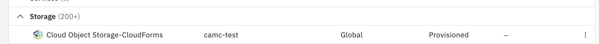
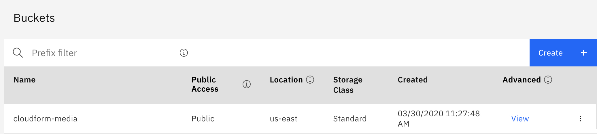
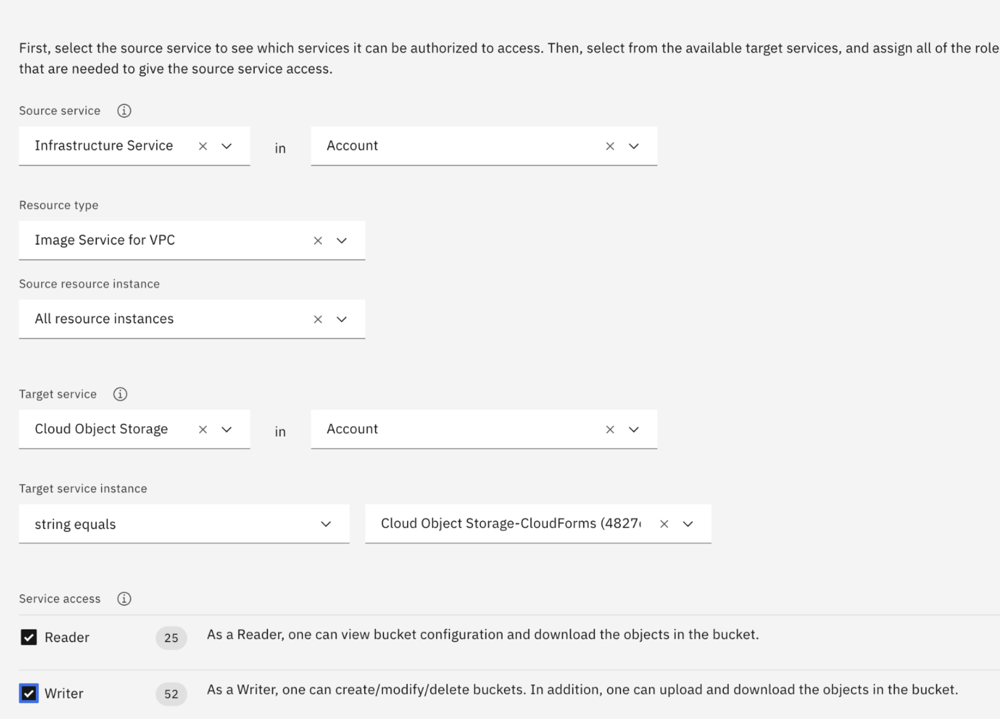
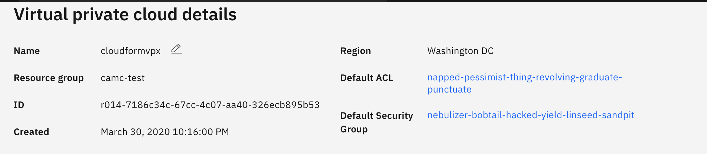
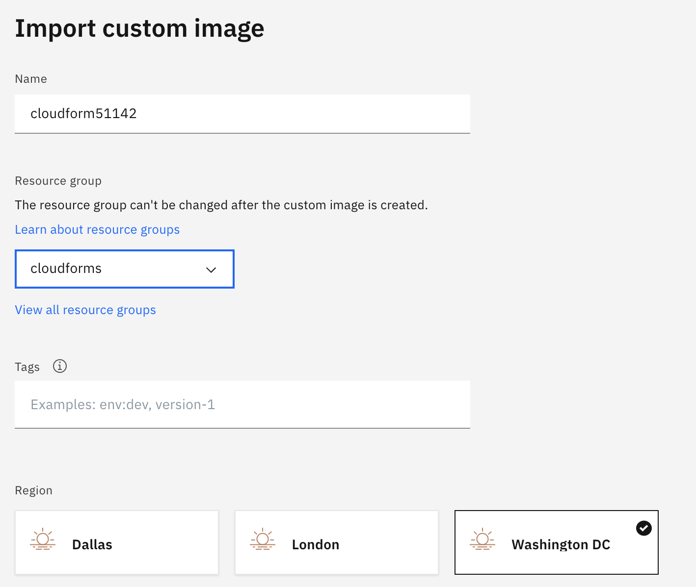
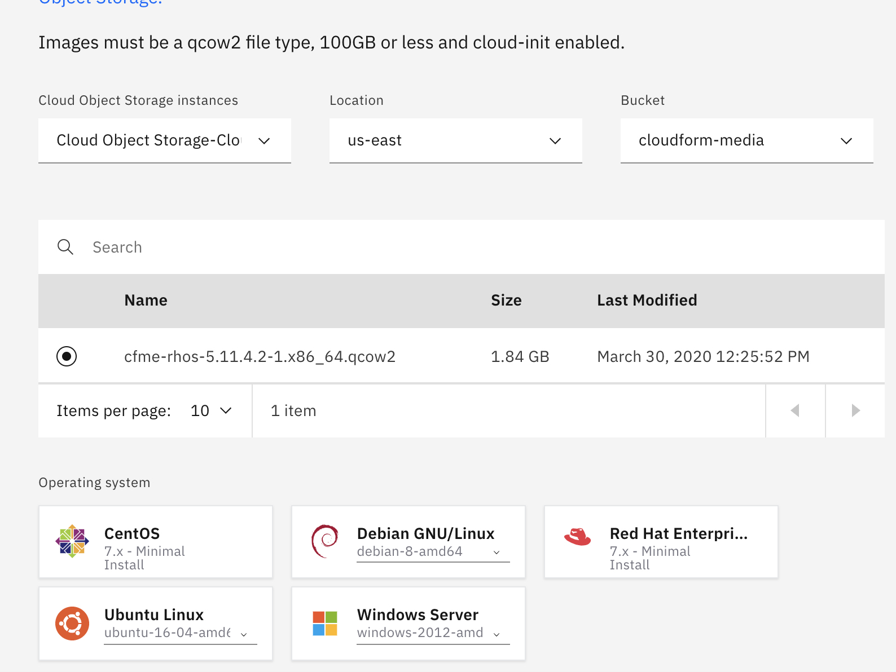
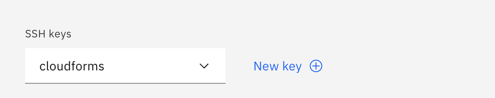
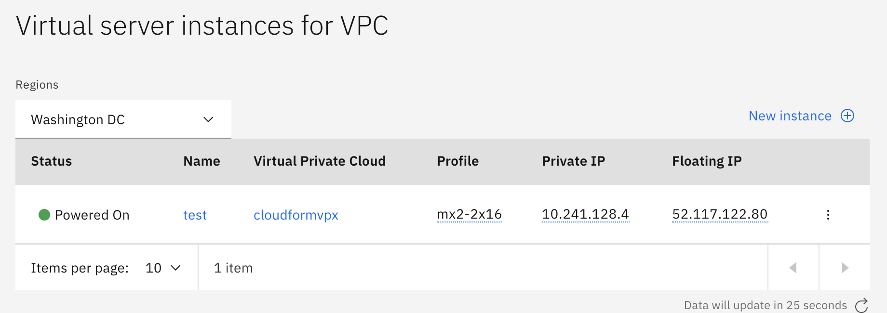
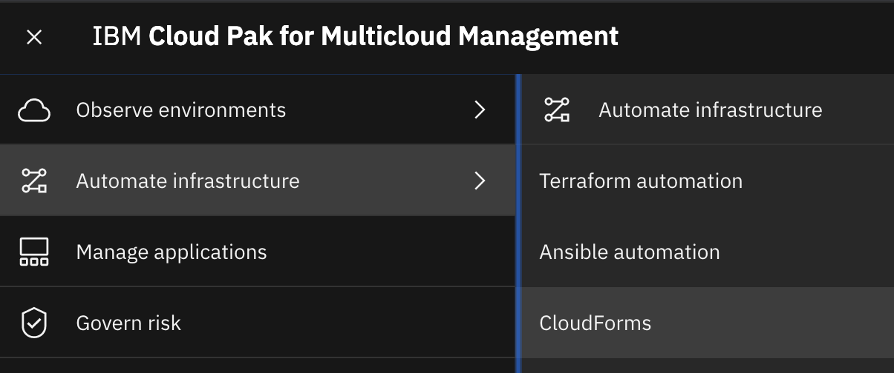

---

copyright:
  years: 2020
lastupdated: "2020-04-16"

keywords: getting started tutorial, getting started, cloudforms

subcollection: cloud-pak-multicloud-management

---

{:shortdesc: .shortdesc}
{:screen: .screen}
{:codeblock: .codeblock}
{:pre: .pre}
{:tip: .tip}
{:note: .note}
{:external: target="_blank" .external}

# Getting started with CloudForms in IBM Cloud
{: #cf-getting-started}

CloudForms delivers the insight, control, and automation enterprises need to address the challenges of managing virtual environments. CloudForms enables enterprises with existing virtual infrastructures to improve visibility and control, and those just starting virtualization deployments to build and operate a well-managed virtual infrastructure. For more information, see the [CloudForms product documentation](https://access.redhat.com/documentation/en-us/red_hat_cloudforms/5.0/).
You can install CloudForms as a virtual appliance in IBM Cloud. 
{:shortdesc}

## Before you begin

- Before you can install CloudForms, you must download the images from [IBM Passport Advantage](https://www.ibm.com/software/passportadvantage/index.html). Download these two part numbers:

| Description                                                                      | File name                               | Passport Advantage part number |
|----------------------------------------------------------------------------------|-----------------------------------------|--------------------------------|
| Red Hat CloudForms 5 for Red Hat OpenStack Platform | cfme-rhos-5.11.4.x86_64.qcow2 |   CC5W9EN  |
| Automation navigation for IBM Cloud Pak® for Multicloud Management 1.3 | automation-navigation-updates.sh | CC66KEN  |

- For the list of all part numbers, see [Passport Advantage part numbers](https://www.ibm.com/support/knowledgecenter/en/SSFC4F_1.3.0/about/part_numbers.html).
  
- You must have an IBM Cloud user account with the following roles: 


- You must have {{site.data.keyword.cp4mcm_full_notm}} installed. For more information, see [Getting started with {{site.data.keyword.cp4mcm_full_notm}}](/getting-started.md)  


## Step A. Setting up the Custom image for CloudForms in IBM Cloud
{: #config-image}
Create a custom Linux-based image to deploy CloudForms as a virtual server instance in the IBM Cloud.

1. If you don't already have an instance of IBM Cloud Object Storage, see [Getting started with IBM Cloud Object Storage](https://cloud.ibm.com/docs/services/cloud-object-storage?topic=cloud-object-storage-getting-started)

    Example Cloud Object Storage created:
    

    You must also create a bucket in IBM Cloud Object Storage to store your images.
    Example Standard type bucket created:
    

2. Upload the CloudForms installation image (file name: `cfme-rhos-5.11.4.x86_64.qcow2`) to your IBM Cloud Object Storage. Select your bucket and click Add Objects to upload the images. For more information, see [Uploading data by using the console](https://cloud.ibm.com/docs/services/cloud-object-storage?topic=cloud-object-storage-upload#upload-console). **Note:** You can use the Aspera high-speed transfer plug-in to upload images larger than 200 MB.  
Example by using Aspera uploaded file to bucket:


3. From IBM Cloud Identity and Access Management (IAM), create an authorization between the Virtual Private Cloud (VPC) Infrastructure (source service) > Image Service for VPC (resource type) and Cloud Object Storage (target service). For more information, see [Create an authorization](https://cloud.ibm.com/docs/iam?topic=iam-serviceauth#serviceauth).
    
    **Important**: The configuration must be set up as this example or permissions can fail. 
    

4. Create a generation 2 Virtual Private Cloud (Must be generation 2). For more information, see [Create a VPC](https://cloud.ibm.com/docs/vpc?topic=vpc-getting-started#create-and-configure-vpc)
  
    a. Create a VPC - The VPC must be in the same resource group and region as your bucket.

    b. Create subnets in one or more zones. You can create subnets in suggested prefix ranges or in your own IP ranges that you bring to IBM Cloud.

    c. Attach a public gateway if you want to allow all resources in a subnet to communicate with the public internet.

    Example VPC: 

5. Configure an access control list (ACL) to limit the subnet's inbound and outbound traffic.

    Example: 


6. Import the CloudForms installation images from the bucket into the VPC.
  
    a. From the custom image tab under the result list, select import custom image.

    b. Enter a name.

    c. Select a resource group.

    d. Select region.

    Example:
    

    e. Select your Cloud Object Storage and bucket based on your authorization that is created in step 3.

    f. Select your qcow2 image.

    g. Select the Red Hat operating system.

    Example:

    
    h. Select import custom image.

    Example of custom image listing after successful image creation: 


7. Create a virtual server from the custom image by selecting "New virtual server".
  
   a. Enter your name.

   b. Select your region.

   c. Select the Red Hat operating system.

   d. Use Memory Profile (2 vcpus, 16 gb ram, 4 gps).

   e. Add an ssh key - Use a public key.

   Example:


    f. Add storage to your virtual service. For example, 100 gigabytes. This volume is needed to configure the CloudForms appliance. 

    Example:


    g. Select create virtual server instance. 
 
8. Update the security group that allows inbound and outbound traffic. Open the server instance, go down to the Network interfaces section, and then modify the security group.
**(Need to harden this -ie 443, 5341...)**

    Example:
  

9. Assign the floating IP address:

    Example:



## Step B. Setting up the CloudForms appliance
{: #config-cloudforms-appliance}

1. Use the `ssh` command to connect to your virtual server instance (appliance) by using the floating IP address. Log in with a username of `root` and the default password `smartvm`. The Bash prompt for the root user is displayed.
  
   Example ssh as root user:
   ```
   ssh root@<host_ip_address>
   ```
    

2. Enter the `appliance_console` command. The CloudForms appliance summary screen is displayed.
3. Press Enter to manually configure settings.

    **Note:** Networking is already configured. You can skip this step.

5. Select _5) Configure database_ from the menu.

    - You are prompted to create or fetch an encryption key.
    If this instance is the first CloudForms appliance, select _1) Create key_.
    
    - If this is not the first CloudForms appliance, select _2) Fetch key_ from remote system to fetch the key from the first appliance. For worker and multi-region setups, use this option to copy key from another appliance.

    **Note:** All CloudForms appliances in a multi-region deployment must use the same key.

6. Select _1) Create Internal Database_ for the database location.
7. Choose a disk for the database. This can be either a disk you attached previously, or a partition on the current disk.

    **Important:** Best practice is using a separate disk for the database.
    
    If there is an unpartitioned disk that is attached to the virtual machine, the dialog shows options similar to the following:
    ```
    1) /dev/vdb: 20480
    2) Don't partition the disk
    ```
    - Enter 1 to choose /dev/vdb for the database location. This option creates a logical volume by using this device and mounts the volume to the appliance in a location appropriate for storing the database. The default location is /var/lib/pgsql, which can be found in the environment variable $APPLIANCE_PG_MOUNT_POINT.
    
    - Enter 2 to continue without partitioning the disk. A second prompt confirms this choice. Selecting this option results in using the root file system for the data directory (not advised in most cases).

8. Enter Y or N for Should this appliance run as a stand-alone database server?
    - Select N to configure the appliance with the full administrative user interface.

9. When prompted, enter a unique number (01-99) to create a new region.

    **Important:** Creating a new region destroys any existing data on the chosen database.

10. Create and confirm a password for the database.

    CloudForms configures the internal database. This takes a few minutes. 

11. Once CloudForms is installed, you can log in and complete administrative tasks.
    - Log in to Red Hat CloudForms for the first time by:
    - Navigate to the URL for the login screen. For example,  `https://xx.xx.xx.xx` on the virtual server instance, where `xx.xx.xx.xx` is the floating IP.
    - Enter the default credentials (Username: admin | Password: smartvm) for the initial login.
    - Click Login.
  
    For more information, see: [Configuring CloudForms](https://access.redhat.com/documentation/en-us/red_hat_cloudforms/5.0/html/installing_red_hat_cloudforms_on_red_hat_openstack_platform/configuring-cloudforms)


## Step C. Integrating CloudForms with IBM Cloud Pak​​ for Multicloud Management
{: #integrate-cloudforms-cp4mcm}

Enable navigation to CloudForms within the IBM Cloud Pak® console.

Complete the following steps on a Linux system. You can use the boot node from the HUB cluster where IBM Cloud Pak​​ for Multicloud Management is installed. These steps enable navigation to CloudForms from the IBM Cloud Pak​​ console:

1. Obtain the Automation navigation for IBM Cloud Pak​​ for Multicloud Management 1.3 script, `automation-navigation-updates.sh`, from [IBM Passport Advantage®](https://www-01.ibm.com/software/passportadvantage/) website. This script was downloaded from IBM Passport Advantage in the "Before you begin" section.

2. Install and authenticate `kubectl`. For more information, see [Installing the Kubernetes CLI (kubectl)](https://www.ibm.com/support/knowledgecenter/SSFC4F_1.3.0/kubectl/install_kubectl.html).

3. Install JQ. For more information, see [Download jq](https://stedolan.github.io/jq/download/).

4. Copy the `automation-navigation-updates.sh` script to a directory location. Set the file permissions on the script and run the script to enable navigation to your CloudForms instance:

   ```
   chmod 755 ./automation-navigation-updates.sh

   ./automation-navigation-updates.sh -c <CloudForms URL>
   ```
     
   * `-c` Is a required parameter that refers to the URL for the CloudForms console. For example, `https://vm17-cf-test.ibm.com/#/`

5. Verify that the CloudForms instance is in the IBM Cloud Pak​​ console navigation menu. From the IBM Cloud Pak​​ navigation menu, click **Automate infrastructure** > **CloudForms**.

CloudForms is integrated with the IBM Cloud Pak​​ console.



