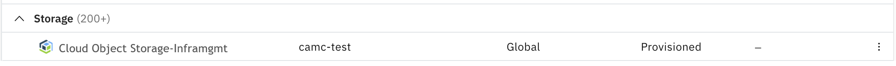
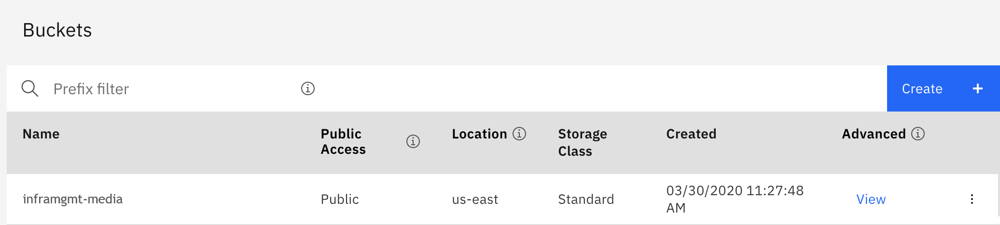
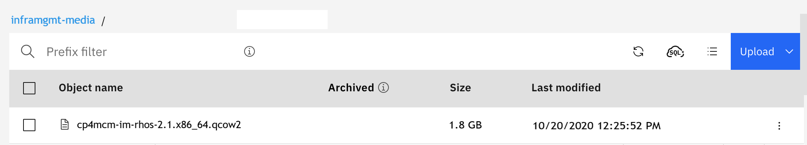
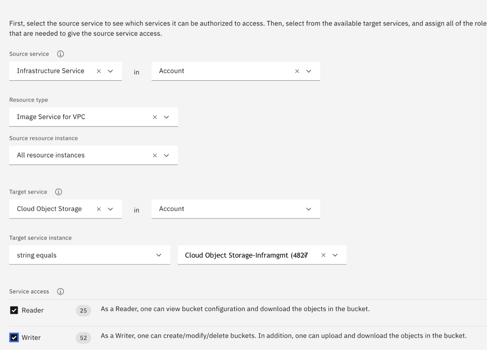
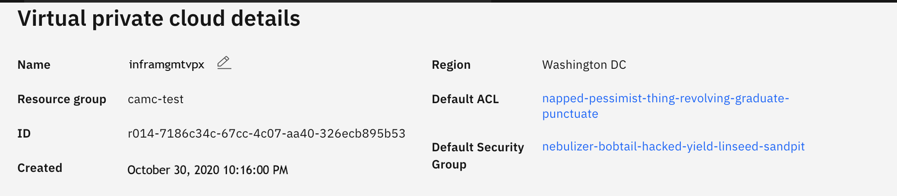
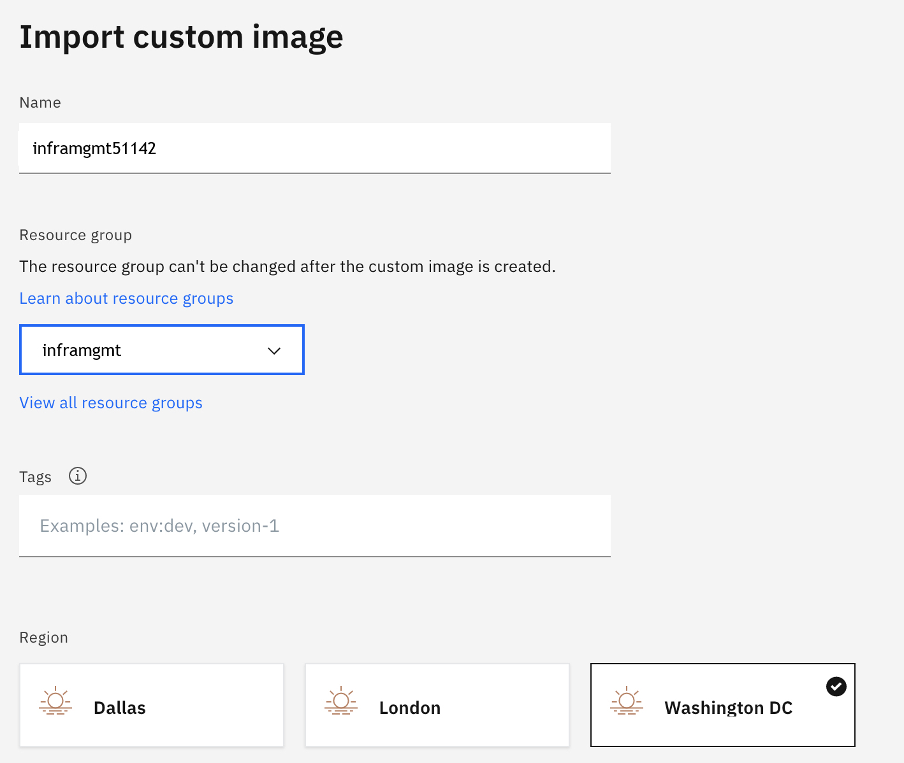
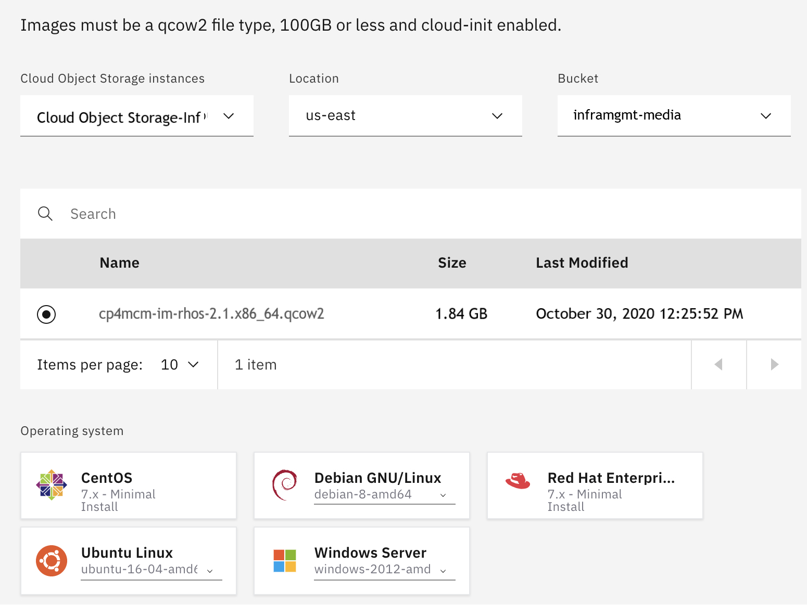
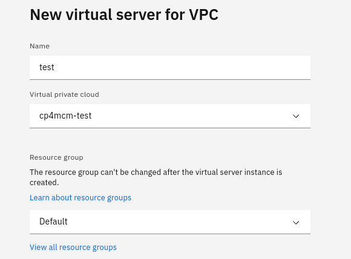
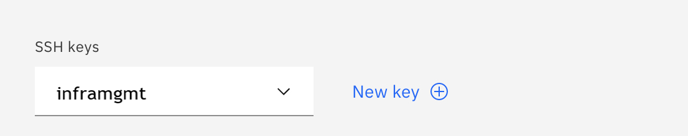
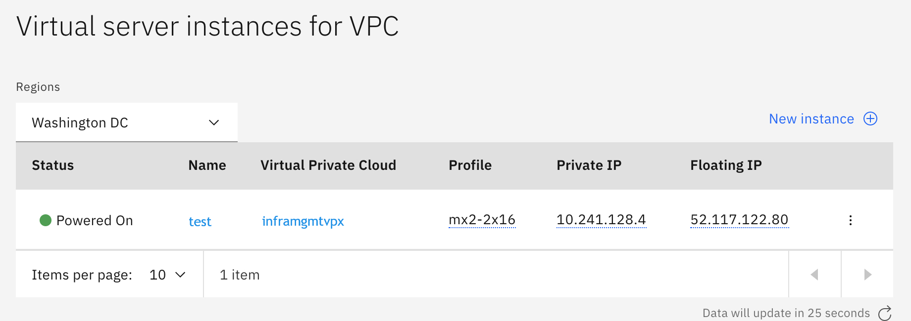

---

copyright:
  years: 2020, 2021
lastupdated: "2021-04-07"

keywords: getting started tutorial, getting started, cloud-pak-multicloud_management

subcollection: cloud-pak-multicloud-management

---

{:shortdesc: .shortdesc}
{:screen: .screen}
{:codeblock: .codeblock}
{:pre: .pre}
{:tip: .tip}
{:note: .note}
{:external: target="_blank" .external}

# Getting started deploying Infrastructure management as a virtual machine appliance

Complete these steps to install Infrastructure management as a virtual machine appliance.
{: shortdesc}
   
## Prerequisites
{: #pre-requisites}
- You must have an IBM Cloud user account with the following roles: 
{: caption="Figure 1. Required roles for IBM Cloud user account" caption-side="bottom"}

- You must have {{site.data.keyword.cp4mcm_full_notm}} installed. For more information, see [Getting started with {{site.data.keyword.cp4mcm_full_notm}} V2.1](https://cloud.ibm.com/docs/cloud-pak-multicloud-management?topic=cloud-pak-multicloud-management-getting-started-21)  

- Ensure you enable the operators for `Infrastructure management` by opening the {{site.data.keyword.mcm}} installation YAML file. Locate the `pakModules` section, and change `enabled: false` to `enabled: true`. Enable these Infrastructure management-related operators:

  - `ibm-management-im-install` for Infrastructure management. For more information, see [Infrastructure management](https://www.ibm.com/support/knowledgecenter/SSFC4F_2.1.0/mcm/infrastructure/infra_mgmt_intro.html).

  - `ibm-management-infra-vm` for provisioning virtual machines and instances. For more information, see [Provisioning Virtual Machines and Instances](https://www.ibm.com/support/knowledgecenter/SSFC4F_2.1.0/Infra_mgmt/provisioning_virtual_machines_and_hosts/index.html).

  - `ibm-management-infra-grc` for Infrastructure management. For more information, see [Governance, risk, and compliance](https://www.ibm.com/support/knowledgecenter/SSFC4F_2.1.0/mcm/compliance/compliance_intro.html).

  For more information, see [Enabling operators after IBM Cloud Pak for Multicloud Management installation](https://www.ibm.com/support/knowledgecenter/SSFC4F_2.1.0/install/enable_operator.html).

- You must configure and connect an LDAP directory with {{site.data.keyword.cp4mcm_full_notm}}. You must have an LDAP group in your configuration for {{site.data.keyword.cp4mcm_full_notm}} with users defined who will access Infrastructure management.      

## Step 1. Download the Infrastructure management appliance package.
{: #download-appliance}
   1. Go to the IBM Passport Advantage Online tab at [IBM Passport Advantage ](https://www.ibm.com/software/passportadvantage/pao_customer.html){: new_window} and log in with your IBM ID.
   2. Find the part number: CC7X2EN
   3. Download the file to a directory on your system.

### Infrastructure management appliance package
{: #inf_man_files}

| Description                                                                      | File name                               | Passport Advantage part number |
|----------------------------------------------------------------------------------|-----------------------------------------|--------------------------------|
|IBM Cloud Pak for Multicloud Management 2.1 Infrastructure management for Red Hat OpenStack Platform |cp4mcm-im-rhos-2.1.x86_64.qcow2|CC7X2EN|

{: caption="Table 1. Infrastructure management appliance packages" caption-side="top"}

## Step 2. Setting up the Custom image for Infrastructure management appliance in IBM Cloud
{: #config-image}

Create a custom Linux-based image to deploy Infrastructure management as a virtual server instance in IBM Cloud.

1. If you don't already have an instance of IBM Cloud Object Storage, see [Getting started with IBM Cloud Object Storage](https://cloud.ibm.com/docs/services/cloud-object-storage?topic=cloud-object-storage-getting-started)

    {: caption="Figure 2. Example Cloud Object Storage created" caption-side="bottom"}

    You must also create a bucket in IBM Cloud Object Storage to store your images.
    {: caption="Figure 3. Example Standard type bucket created" caption-side="bottom"}

2. Upload the Infrastructure management installation image (file name: `cp4mcm-im-rhos-2.1.x86_64.qcow2`) to your IBM Cloud Object Storage. Select your bucket and click Add Objects to upload the images. For more information, see [Uploading data by using the console](https://cloud.ibm.com/docs/services/cloud-object-storage?topic=cloud-object-storage-upload#upload-console). 

   **Note:** You can use the Aspera high-speed transfer plug-in to upload images larger than 200 MB.  
{: caption="Figure 4. Example using Aspera uploaded file to bucket" caption-side="bottom"}

3. From IBM Cloud Identity and Access Management (IAM), create an authorization between the Virtual Private Cloud (VPC) Infrastructure (source service) > Image Service for VPC (resource type) and Cloud Object Storage (target service). For more information, see [Create an authorization](https://cloud.ibm.com/docs/iam?topic=iam-serviceauth#serviceauth).
    
    **Important**: The configuration must be set up as this example or permissions can fail. 
    {: caption="Figure 5. Example IAM authorization" caption-side="bottom"}

4. Create a generation 2 Virtual Private Cloud (**Must be generation 2**). For more information, see [Create a VPC](https://cloud.ibm.com/docs/vpc?topic=vpc-getting-started#create-and-configure-vpc)
  
    a. Create a VPC - The VPC must be in the same resource group and region as your bucket.

    b. Create subnets in one or more zones. You can create subnets in suggested prefix ranges or in your own IP ranges that you bring to IBM Cloud.

    c. Attach a public gateway if you want to allow all resources in a subnet to communicate with the public internet.

    {: caption="Figure 6. Example VPC" caption-side="bottom"}

5. Configure an access control list (ACL) to limit the subnet's inbound and outbound traffic.

    {: caption="Figure 7. Example ACL" caption-side="bottom"}

6. Import the Infrastructure management installation images from the bucket into the VPC.
  
    a. Browse to **VPC Infrastructure** > **Compute** > **Custom images** and select **import custom image**.

    b. Enter a name.

    c. Select a resource group.

    d. Select the region.

    {: caption="Figure 8. Example import of custom image" caption-side="bottom"}

    e. Select your Cloud Object Storage and bucket based on your authorization that is created in step 3.

    f. Select your qcow2 image (your custom image).

    g. Select the CentOS for Operating system.

    h. Click **Import custom image**.

    {: caption="Figure 9. Example of custom image imported" caption-side="bottom"}

    {: caption="Figure 10. Example of custom image listing after successful image creation" caption-side="bottom"}

7. Create a virtual server from the custom image by clicking the "three dot menu" of that image, then selecting "New virtual server".
{: caption="Figure 11. Select New virtual server from the three dot menu" caption-side="bottom"}
  
   a. Enter your name. Select the Virtual private cloud and Resource group.
   {: caption="Figure 12. Enter your name, select the Virtual private cloud and Resource group" caption-side="bottom"}

   b. Select your region.

   c. Select your own custom image (.qcow2 file)that you imported, not an OS image.

   d. Use Memory Profile (2 vcpus, 16 gb ram, 4 gps).

   e. Add an ssh key. You can use a public key. For more information, see: [Locating or generating your SSH key](https://cloud.ibm.com/docs/vpc-on-classic-vsi?topic=vpc-on-classic-vsi-ssh-keys#locating-or-generating-your-ssh-key).

   {: caption="Figure 13. Add an ssh key" caption-side="bottom"}

   f. Add storage to your virtual service. For example, 100 gigabytes. This volume is needed to configure the Infrastructure management appliance. 

   **Note:** Make sure that the data volume name is unique and not named the same as another volume across your virtual server instances.

   {: caption="Figure 14. Example Data volumes" caption-side="bottom"}

    g. Select create virtual server instance. 
 
8. Update the security group that allows inbound and outbound traffic. Open the server instance, go down to the Network interfaces section, and then modify the security group.

   {: caption="Figure 15. Example security group that allows inbound and outbound traffic" caption-side="bottom"}

9. Assign the floating IP address:

   {: caption="Figure 16. Example Floating IP address assigned" caption-side="bottom"}


## Step 3. Setting up the Infrastructure management appliance
{: #config-im-appliance}

1. Use the `ssh` command to connect to your virtual server instance (appliance) by using the floating IP address. Log in with a username of `root` and the default password `smartvm`. The Bash prompt for the root user is displayed.
  
   Example ssh as root user:
   ```
   ssh root@<host_ip_address>
   ```
2. Enter the `appliance_console` command. The Infrastructure management appliance summary screen is displayed.

   {: caption="Figure 17. Welcome to the Appliance Console" caption-side="bottom"}

3. Press Enter to manually configure settings.

    **Note:** Networking is already configured. You can skip this step.

4. Select _5) Configure database_ from the menu.

    - You are prompted to create or fetch an encryption key.
    If this instance is the first Infrastructure management appliance, select _1) Create key_.
    
    - If this is not the first Infrastructure management appliance, select _2) Fetch key_ from remote system to fetch the key from the first appliance. For worker and multi-region setups, use this option to copy key from another appliance.

    **Note:** All Infrastructure management appliances in a multi-region deployment must use the same key.

5. Select _1) Create Internal Database_ for the database location.

6. Choose a disk for the database. The disk can be either a disk you attached previously, or a partition on the current disk.

    **Important:** Best practice is using a separate disk for the database.
    
    If an unpartitioned disk is attached to the virtual machine, the dialog shows the options. For example,
    ```
    1) /dev/vdb: 20480
    2) Don't partition the disk
    ```
    - Enter 1 to choose /dev/vdb for the database location. This option creates a logical volume by using this device and mounts the volume to the appliance in a location appropriate for storing the database. The default location is /var/lib/pgsql, which can be found in the environment variable $APPLIANCE_PG_MOUNT_POINT.
    
    - Enter 2 to continue without partitioning the disk. A second prompt confirms this choice. Selecting this option results in using the root file system for the data directory (not advised in most cases).

7. Enter N for "Should this appliance run as a stand-alone database server?"
    - Select N to configure the appliance with the full administrative user interface.

8. When prompted, enter a unique number (01-99) to create a new region.

    **Important:** Creating a new region deletes any existing data on the chosen database.

9.  Create and confirm a password for the database.

    Infrastructure management configures the internal database. This takes a few minutes. 

10. Once Infrastructure management is installed, you can log in and complete administrative tasks.
    - Log in to Infrastructure management for the first time by:
    - Select the URL for the login screen. For example,  `https://xx.xx.xx.xx` on the virtual server instance, where `xx.xx.xx.xx` is the floating IP.
    - Enter the default credentials (Username: admin | Password: smartvm) for the initial login.
    - Click Login.

## Step 4. Register Infrastructure management instance with IAM as an OIDC client 
{: #register-im-with-IAM-as-OIDC-client}

In order to enable single sign-on (SSO) between IBM Cloud Pak​​ for Multicloud Management and Infrastructure management with OIDC, the Infrastructure management instance needs to register as an OIDC client with Identity and Access Management (IAM). Complete these steps on the {{site.data.keyword.cp4mcm_full_notm}} cluster.

   **Note:**
   
   Only OIDC-based authentication (OpenID Connect) is supported. The configuration of OpenID Connect (OIDC) is required for integration with Infrastructure management and {{site.data.keyword.cp4mcm_full_notm}}.

You can register Infrastructure management as an OIDC client with IAM using the `cloudctl` command.

The registration method requires the following registration payload in a file "registration.json":

```
{
  "token_endpoint_auth_method":"client_secret_basic",
  "client_id": "<YOUR_CLIENT_ID>",
  "client_secret": "<YOUR_CLIENT_SECRET>",
  "scope":"openid profile email",
  "grant_types":[
     "authorization_code",
     "client_credentials",
     "password",
     "implicit",
     "refresh_token",
     "urn:ietf:params:oauth:grant-type:jwt-bearer"
  ],
  "response_types":[
     "code",
     "token",
     "id_token token"
  ],
  "application_type":"web",
  "subject_type":"public",
  "post_logout_redirect_uris":[
     "https://<YOUR_CP4MCM_ROUTE>"   ],
  "preauthorized_scope":"openid profile email general",
  "introspect_tokens":true,
  "trusted_uri_prefixes":[
     "https://<YOUR_CP4MCM_ROUTE>/"    ],
  "redirect_uris":["https://<YOUR_CP4MCM_ROUTE>/auth/liberty/callback","https://<INFRA_MGMT_URL>/oidc_login/redirect_uri"]
}
```
{: codeblock}

Example registration payload (for reference only):
```
{
  "token_endpoint_auth_method":"client_secret_basic",
  "client_id": "N3NzNVFsSjlLVkl6Zk5hZ01MRzJVaVdnbFcxNGl5cnQK",
  "client_secret": "VWNVNzF4ZUxNSVBQUHZHdG1xQmNsTTFOWmNUUGlnYUkK",
  "scope":"openid profile email",
  "grant_types":[
     "authorization_code",
     "client_credentials",
     "password",
     "implicit",
     "refresh_token",
     "urn:ietf:params:oauth:grant-type:jwt-bearer"
  ],
  "response_types":[
     "code",
     "token",
     "id_token token"
  ],
  "application_type":"web",
  "subject_type":"public",
  "post_logout_redirect_uris":["https://cp-console.apps.test.ibm.com"],
  "preauthorized_scope":"openid profile email general",
  "introspect_tokens":true,
  "trusted_uri_prefixes":["https://cp-console.apps.test.ibm.com/"],
  "redirect_uris":["https://cp-console.apps.test.ibm.com/auth/liberty/callback","https://vm17-im-test.ibm.com/oidc_login/redirect_uri"]
}
```

1. Create a file named `registration.json` from the example template. Replace the values in the example template payload registration with the actual values based on your installation. 

    - `YOUR_CLIENT_ID` Your base64 encoded character string.
    - `YOUR_CLIENT_SECRET` Your base64 encoded character string.
      
      **Note:** The `<YOUR_CLIENT_ID>` and `<YOUR_CLIENT_SECRET>` need to be generated. The values can be any string, but normally a 32 character string that is base64 encoded is used. You can use BASE64 to encode your character string. For more information, see: [BASE64](https://www.base64encode.org/). Make a note of the values you generate for `<YOUR_CLIENT_ID>` and `<YOUR_CLIENT_SECRET>`. You will use the values in the next section to update the Apache configuration file.
  
      Example command that uses base64 to encode a character string:
      ```
      #
      # Generate two encrypted streams from some longer-than-32-characters strings
      #
      echo There is a huge white elephant in LA zoo |base64
      
      echo 12345678901234567890123456789012345 |base64
      ```

    - `YOUR_CP4MCM_ROUTE` The URL of the {{site.data.keyword.cp4mcm_full_notm}} console.
    - `INFRA_MGMT_URL` The URL of the Infrastructure management virtual machine appliance.
    - `post_logout_redirect_uris` The URL of the {{site.data.keyword.cp4mcm_full_notm}} console.
    - `trusted_uri_prefixes` The URL of the {{site.data.keyword.cp4mcm_full_notm}} console with "forward slash" /.
    - `redirect_uris` The URL of the {{site.data.keyword.cp4mcm_full_notm}} console with the path to call back and the URL of the Infrastructure management host with the path to the redirect_uri.

    **Note:** You can run the following command on the {{site.data.keyword.cp4mcm_full_notm}} cluster to determine the URL of the {{site.data.keyword.cp4mcm_full_notm}} console:
    ```
    oc get routes cp-console -o=jsonpath='{.spec.host}' -n ibm-common-services
    ```

2. After the file `registration.json` is completed, log in and run the command to register Infrastructure management as an OIDC client.
   
   **Note:** Include the `-n ibm-common-services` to specify this project, or the `cloudctl iam` command can fail.
    ```
    cloudctl login -a https://<YOUR_CP4MCM_ROUTE> -n ibm-common-services
    ```
    {: codeblock}

    Example `cloudctl iam` command:
    ```
    cloudctl iam oauth-client-register -f registration.json
    ```
    {: codeblock}   
    
## Step 5. Import the Root CA certificate to the Infrastructure management appliance from {{site.data.keyword.cp4mcm_full_notm}}
{: #import-root-ca-certificate}

1. Retrieve the cluster CA cert from {{site.data.keyword.cp4mcm_full_notm}} by running this command on the cluster:
   ```
   oc get secret -n ibm-common-services ibmcloud-cluster-ca-cert -o jsonpath='{.data.ca.crt}'| base64 –decode
   ```
   {: codeblock}

2. Copy and paste the output to a file, for example `ibm_cp_im.crt`

3. Edit the `ibm_cp_im.crt` file, and change:
   - `BEGIN CERTIFICATE` to `BEGIN TRUSTED CERTIFICATE`
   - `END CERTIFICATE` to `END TRUSTED CERTIFICATE`

    **Note:** The following steps must be completed by logging in to the Infrastructure management appliance system as root user:

4. Copy the updated `ibm_cp_im.crt` file to the Infrastructure management appliance and save it in the directory: `/etc/pki/ca-trust/source/anchors`

5. Run the command:
   ```
   update-ca-trust
   ```
   {: codeblock}
6. Restart the evm server by running the command:
   ```
   systemctl restart evmserverd
   ```
   {: codeblock}

7. Copy the Apache OIDC template configuration file with these steps:
   ```
   export TEMPLATE_DIR="/opt/IBM/infrastructure-management-appliance/TEMPLATE"
   ```
   {: codeblock}

   ```
   cp ${TEMPLATE_DIR}/etc/httpd/conf.d/manageiq-remote-user-openidc.conf /etc/httpd/conf.d/
   ```
   {: codeblock}
   ```
   cp ${TEMPLATE_DIR}/etc/httpd/conf.d/manageiq-external-auth-openidc.conf.erb  /etc/httpd/conf.d/manageiq-external-auth-openidc.conf
   ```
   {: codeblock}

8. The Apache `/etc/httpd/conf.d/manageiq-external-auth-openidc.conf` configuration file must be updated with installation-specific values. Replace the contents of the file with the actual values based on the installation.
   
   Example template for the configuration file:

   ```
   LoadModule          auth_openidc_module modules/mod_auth_openidc.so
   ServerName          https://<YOUR_IM_APPLIANCE_HOSTNAME>
   LogLevel            warn
   
   OIDCCLientID                   <YOUR_CLIENT_ID>
   OIDCClientSecret               <YOUR_CLIENT_SECRET>
   OIDCRedirectURI                https://<YOUR_IM_APPLIANCE_HOSTNAME>/oidc_login/redirect_uri
   OIDCCryptoPassphrase           <PASSPHRASE>
   OIDCOAuthRemoteUserClaim       sub
   OIDCRemoteUserClaim            name
   
   OIDCOAuthClientID                  <YOUR_CLIENT_ID>
   OIDCOAuthClientSecret              <YOUR_CLIENT_SECRET>
   OIDCOAuthIntrospectionEndpoint     https://<YOUR_CP4MCM_ROUTE>/idprovider/v1/auth/introspect
   OIDCOAuthIntrospectionEndpointAuth client_secret_basic
   
   OIDCProviderIssuer                  https://127.0.0.1:443/idauth/oidc/endpoint/OP
   OIDCProviderAuthorizationEndpoint   https://<YOUR_CP4MCM_ROUTE>/idprovider/v1/auth/authorize
   OIDCProviderTokenEndpoint           https://<YOUR_CP4MCM_ROUTE>/idprovider/v1/auth/token
   OIDCOAuthIntrospectionEndpoint      https://<YOUR_CP4MCM_ROUTE>/idprovider/v1/auth/introspect
   OIDCProviderJwksUri                 https://<YOUR_CP4MCM_ROUTE>/oidc/endpoint/OP/jwk
   OIDCProviderEndSessionEndpoint      https://<YOUR_CP4MCM_ROUTE>/idprovider/v1/auth/logout
   
   OIDCScope                        "openid email profile"
   OIDCResponseMode                 "query"
   OIDCProviderTokenEndpointAuth     client_secret_post
   
   OIDCPassUserInfoAs json
   OIDCSSLValidateServer off
   OIDCHTTPTimeoutShort 10
   
   OIDCCacheEncrypt On
   <Location /oidc_login>
     AuthType  openid-connect
     Require   valid-user
     LogLevel  debug
   </Location>
   
   <LocationMatch ^/api(?!\/(v[\d\.]+\/)?product_info$)>
     SetEnvIf Authorization '^Basic +YWRtaW46'     let_admin_in
     SetEnvIf X-Auth-Token  '^.+$'                 let_api_token_in
     SetEnvIf X-MIQ-Token   '^.+$'                 let_sys_token_in
     SetEnvIf X-CSRF-Token  '^.+$'                 let_csrf_token_in
   
     AuthType  oauth20
     AuthName  "External Authentication (oidc) for API"
   
     Require   valid-user
     Order     Allow,Deny
     Allow from env=let_admin_in
     Allow from env=let_api_token_in
     Allow from env=let_sys_token_in
     Allow from env=let_csrf_token_in
     Satisfy   Any
     LogLevel  debug
   </LocationMatch>
   ```
   - `YOUR_IM_APPLIANCE_HOSTNAME` Specifies the hostname of the Infrastructure management appliance server.
   - `YOUR_CLIENT_ID` The client ID used for registering Infrastructure management as an OIDC client with IAM.
   - `YOUR_CLIENT_SECRET` The client secret that is used for registering Infrastructure management as an OIDC client with IAM.
   - `YOUR_CP4MCM_ROUTE` The URL of the IBM Cloud Pak for Multicloud Management console.
   - `OIDCCryptoPassphrase` Can be any arbitrary alpha-numeric string.
   
   **Note:** `YOUR_CLIENT_ID` and `YOUR_CLIENT_SECRET` values are generated when you register Infrastructure Management as an OIDC client.

   Example template for the configuration file (for reference only):
   
   ```
   LoadModule          auth_openidc_module modules/mod_auth_openidc.so
   ServerName          https://vm17-im-test.ibm.com
   LogLevel            warn
   
   OIDCCLientID                       N3NzNVFsSjlLVkl6Zk5hZ01MRzJVaVdnbFcxNGl5cnQK
   OIDCClientSecret                   OS40Ni42OC4xMTljbGllbnRfc2VjcmV0Cg==
   OIDCRedirectURI                    https://vm17-im-test.ibm.com/oidc_login/redirect_uri
   OIDCCryptoPassphrase               alphabeta
   OIDCOAuthRemoteUserClaim           sub
   OIDCRemoteUserClaim                name
   
   OIDCOAuthClientID                  N3NzNVFsSjlLVkl6Zk5hZ01MRzJVaVdnbFcxNGl5cnQK
   OIDCOAuthClientSecret              OS40Ni42OC4xMTljbGllbnRfc2VjcmV0Cg==
   OIDCOAuthIntrospectionEndpoint     https://cp-console.apps.test.ibm.com/idprovider/v1/auth/introspect
   OIDCOAuthIntrospectionEndpointAuth client_secret_basic
   
   OIDCProviderIssuer                 https://127.0.0.1:443/idauth/oidc/endpoint/OP
   OIDCProviderAuthorizationEndpoint  https://cp-console.apps.test.ibm.com/idprovider/v1/auth/authorize
   OIDCProviderTokenEndpoint          https://cp-console.apps.test.ibm.com/idprovider/v1/auth/token
   OIDCOAuthIntrospectionEndpoint     https://cp-console.apps.test.ibm.com/idprovider/v1/auth/introspect
   OIDCProviderJwksUri                https://cp-console.apps.test.ibm.com/oidc/endpoint/OP/jwk
   OIDCProviderEndSessionEndpoint     https://cp-console.apps.test.ibm.com/idprovider/v1/auth/logout
   
   OIDCScope                          "openid email profile"
   OIDCResponseMode                   "query"
   OIDCProviderTokenEndpointAuth      client_secret_post
   
   OIDCPassUserInfoAs json
   OIDCSSLValidateServer off
   OIDCHTTPTimeoutShort 10
   
   OIDCCacheEncrypt On
   <Location /oidc_login>
     AuthType  openid-connect
     Require   valid-user
     LogLevel  debug
   </Location>
   
   <LocationMatch ^/api(?!\/(v[\d\.]+\/)?product_info$)>
     SetEnvIf Authorization '^Basic +YWRtaW46'     let_admin_in
     SetEnvIf X-Auth-Token  '^.+$'                 let_api_token_in
     SetEnvIf X-MIQ-Token   '^.+$'                 let_sys_token_in
     SetEnvIf X-CSRF-Token  '^.+$'                 let_csrf_token_in
   
     AuthType  oauth20
     AuthName  "External Authentication (oidc) for API"
   
     Require   valid-user
     Order     Allow,Deny
     Allow from env=let_admin_in
     Allow from env=let_api_token_in
     Allow from env=let_sys_token_in
     Allow from env=let_csrf_token_in
     Satisfy   Any
     LogLevel  debug
   </LocationMatch>
   ```

9. Restart Apache on the appliance.
   ```
   systemctl restart httpd
   ```
   {: codeblock}

## Step 6. Configure the Administrative UI
{: #config-ui-appliance}

Update the Appliance Administrative UI to be OIDC aware and function. Complete these steps on each UI-enabled Infrastructure management appliance.

1. Log in as `admin`, then select the **Configuration** by clicking the gear icon.

2. Select the **Settings**, select **"Server "EVM [1]" (current)"** under Zones, then select the **Authentication** tab.

3. In the **Authentication** section, set the **Mode** to `External (httpd)`

4. In the **External Authentication (HTTPd) Settings** section, set **Provider Type** to `Enable OpenID-Connect`. 
     - **Note:** This setting enables the OIDC login button on the login screen that redirects to the OIDC protected page for authentication, and supports the OIDC logout process.

5. Optional: In the **External Authentication (HTTPd) Settings** section, select **Enable Single Sign-On**.
     - **Note:** If you select this option, the initial access to the Appliance Administrative UI will redirect to the OIDC Identity Provider authentication screen.

6. In the **Role Settings** section, select the **Get User Groups from External Authentication (HTTPd)** setting.

7. Click Save.
     
8. Select **Access Control**, click **Groups** and make sure the user’s groups are created on the Appliance and appropriate roles are assigned to those groups. The user's groups to be added in Infrastructure management should have the same names as the groups defined in the LDAP server that is configured in the IBM Cloud Pak console.

   1. Under the **Access Control**, click **Groups**.
   2. Click **Configuration**, then **Add a new Group**.
   3. Enter your existing LDAP group name in the **Description** field. For example, `im_ldap_group`.
   4. Select the **Role** for this LDAP group.
      For example, select the **EvmRole-super_administrator** to map to this group. The Infrastructure management administrator can map to the roles that make sense for the user group.
   5. Select **My Company** for **Project/Tenant**.
   6. Click Add.

    **Note:** Access control in Infrastructure management is based on group membership as roles are assigned to groups. When Infrastructure management is integrated with {{site.data.keyword.cp4mcm_full_notm}} using single sign-on (SSO), it looks at the user’s group membership in the identity token and checks if that group exists in Infrastructure management. If the group doesn't exist, then access is denied. You must create at least one group with the role **EvmRole-super_administrator** and assign one user to this group. This user will be the Admin user for Infrastructure management and referred to as `IM_ADMIN_LDAP_USER`. The `IM_ADMIN_LDAP_USER` must be a member of the LDAP group with the role **EvmRole-super_administrator** in Infrastructure management.
    
    **Important:** You must create the groups in Infrastructure management that match your existing LDAP groups by name, and assign the groups account roles. At least one group to which the user belongs in LDAP that {{site.data.keyword.cp4mcm_full_notm}} is configured to use must also be created in Infrastructure management. You must assign a proper role to this group in Infrastructure management.     
    
    Example:
    In LDAP a group that is named `imgroup100` exists and a user with username `imuser100` is a member of the group. The user `imuser100` and the group `imgroup100` must be created in Infrastructure management.

## Step 7. Integrating Infrastructure management with {{site.data.keyword.cp4mcm_full_notm}}
{: #integrate-im-cp4mcm}

Enable navigation to Infrastructure management within the IBM Cloud Pak® console.

Complete the following steps on a Linux system. You can use the boot node from the HUB cluster where {{site.data.keyword.cp4mcm_full_notm}} is installed. These steps enable navigation to Infrastructure management from the IBM Cloud Pak​​ console:

1. Obtain the menu customization script, `automation-navigation-updates.sh`, from [IBM Passport Advantage® ](https://www-01.ibm.com/software/passportadvantage/){: new_window} website. You must run the script on a Linux operating system.

2. Install and authenticate `kubectl`. For more information, see [Installing the Kubernetes CLI (kubectl)](https://www.ibm.com/support/knowledgecenter/SSFC4F_2.1.0/kubectl/install_kubectl.html). 

3. Download and configure the JQ tool by using the following commands:
   ```
   wget -O jq https://github.com/stedolan/jq/releases/download/jq-1.6/jq-linux64

   chmod +x ./jq

   mv jq /usr/bin
   ```
   For more information, see [Download jq](https://stedolan.github.io/jq/download/).

4. Copy the `automation-navigation-updates.sh` script to a directory location. Set the file permissions on the script and run the script to enable navigation to your Infrastructure management instance:

   ```
   chmod 755 ./automation-navigation-updates.sh

   ./automation-navigation-updates.sh -i <Infrastructure management URL>
   ```
     
   * `-i` Is a required parameter that refers to the URL for the Infrastructure management console. For example, `./automation-navigation-updates.sh -i https://vm17-im-test.ibm.com/`

5. Verify that the Infrastructure management instance is in the IBM Cloud Pak​​ console navigation menu. From the IBM Cloud Pak​​ navigation menu, click **Automate infrastructure** > **Infrastructure management**.

Infrastructure management is integrated with the IBM Cloud Pak​​ console.

## Step 8. Create the VM connection for the VM operator
{: #create-vm-connection}

To use the functional operator `ibm-management-infra-vm` with Infrastructure management, you must create a Connection CR. Use these steps to create a default connection and update as needed. 

**Notes:**

- The default connection name of `imconnection` is used by the operators unless otherwise specified in the CR. You can use the OpenShift Container Platform console or the CLI (command-line tools).
- The `YOUR_CLIENT_ID` and `YOUR_CLIENT_SECRET` values are generated when you register Infrastructure Management as an OIDC client.
- The `IM_ADMIN_LDAP_USER` must be a member of the LDAP group with the role **EvmRole-super_administrator** in Infrastructure management.

- `IM_ADMIN_LDAP_USER` Specifies the Infrastructure management LDAP admin user.
- `IM_ADMIN_LDAP_PASS` Specifies the Infrastructure management LDAP admin password.
- `YOUR_CP4MCM_HOST` The hostname of the IBM Cloud Pak for Multicloud Management console.
- `YOUR_CLIENT_ID` The client ID used for registering Infrastructure management as an OIDC client with IAM.
- `YOUR_CLIENT_SECRET` The client secret that is used for registering Infrastructure management as an OIDC client with IAM.   
   **Note:** The `YOUR_CLIENT_ID` and `YOUR_CLIENT_SECRET` values are generated when you register Infrastructure Management as an OIDC client. 

### Using the CLI to create the connection:
1. Create a secret yaml file named `imconnectionsecret.yaml` with the following content.
   ```yaml
   apiVersion: v1
   kind: Secret
   metadata:
     name: imconnectionsecret
     namespace: management-infrastructure-management
   type: Opaque
   stringData:
     oauth_username: <IM_ADMIN_LDAP_USER>
     oauth_password: <IM_ADMIN_LDAP_PASS>
     cpconsole: <YOUR_CP4MCM_HOST>
     clientid: <YOUR_CLIENT_ID>
     clientsecret: <YOUR_CLIENT_SECRET>
   ```
   Example secret (for reference only):
   ```yaml
   apiVersion: v1
   kind: Secret
   metadata:
     name: imconnectionsecret
     namespace: management-infrastructure-management
   type: Opaque
   stringData:
     oauth_username: im_admin_user
     oauth_password: myT9XjFjkA2yeL9pzvacaUCj1lN3cyaH
     cpconsole: cp-console.apps.test.ibm.com
     clientid: N3NzNVFsSjlLVkl6Zk5hZ01MRzJVaVdnbFcxNGl5cnQK
     clientsecret: OS40Ni42OC4xMTljbGllbnRfc2VjcmV0Cg==
   ```
         
2. Run the `oc` command to create the secret.
   ```
   oc create -n management-infrastructure-management -f imconnectionsecret.yaml
   ```
3. Create a yaml file that is named `imconnection.yaml` based on the following to create the connection CR.
   ```yaml
   apiVersion: infra.management.ibm.com/v1alpha1
   kind: Connection
   metadata:
     labels:
       app.kubernetes.io/instance: connection-1
       app.kubernetes.io/managed-by: connections.infra.management.ibm.com
       app.kubernetes.io/name: example-connection
     name: imconnection
     namespace: management-infrastructure-management
   spec:
     cfHost: <YOUR_IM_APPLIANCE_HOSTNAME>
     secrets:
       accessToken:
         secretKeyRef:
           key: accesstoken
           name: imconnectionsecret
   ```
   - `YOUR_IM_APPLIANCE_HOSTNAME` Specifies the hostname of the Infrastructure management appliance server.
4. Run the `oc` command to create the connection. 
```
oc apply -n management-infrastructure-management -f imconnection.yaml
```

### Using the OpenShift Console to create the connection:

- `IM_ADMIN_LDAP_USER` Specifies the Infrastructure management LDAP admin user.
- `IM_ADMIN_LDAP_PASS` Specifies the Infrastructure management LDAP admin password.
- `YOUR_CP4MCM_HOST` The hostname of the IBM Cloud Pak for Multicloud Management console.
- `YOUR_CLIENT_ID` The client ID used for registering Infrastructure management as an OIDC client with IAM.
- `YOUR_CLIENT_SECRET` The client secret that is used for registering Infrastructure management as an OIDC client with IAM.   
   **Note:** The `YOUR_CLIENT_ID` and `YOUR_CLIENT_SECRET` values are generated when you register Infrastructure Management as an OIDC client. The `IM_ADMIN_LDAP_USER` must be a member of the LDAP group with the role **EvmRole-super_administrator** in Infrastructure management. 

1. Browse to **Workloads > Secrets**
2. Click **Create** and select **From YAML** from the drop-down.
3. Update the YAML (You can use this example `imconnectionsecret.yaml`).
   ```yaml
   apiVersion: v1
   kind: Secret
   metadata:
     name: imconnectionsecret
     namespace: management-infrastructure-management
   type: Opaque
   stringData:
     oauth_username: <IM_ADMIN_LDAP_USER>
     oauth_password: <IM_ADMIN_LDAP_PASS>
     cpconsole: <YOUR_CP4MCM_HOST>
     clientid: <YOUR_CLIENT_ID>
     clientsecret: <YOUR_CLIENT_SECRET>
   ```   
4. Click **Create**.
5. Browse to **Operators > Installed Operators**.
6. Click **IBM Management Infrastructure for virtual machines**.
7. Click **Create instance** for the **Connection** kind under **Provided APIs**.
8. Update the YAML (You can use this example `imconnection.yaml`)
   ```yaml
   apiVersion: infra.management.ibm.com/v1alpha1
   kind: Connection
   metadata:
     labels:
       app.kubernetes.io/instance: connection-1
       app.kubernetes.io/managed-by: connections.infra.management.ibm.com
       app.kubernetes.io/name: example-connection
     name: imconnection
     namespace: management-infrastructure-management
   spec:
     cfHost: <YOUR_IM_APPLIANCE_HOSTNAME>
     secrets:
       accessToken:
         secretKeyRef:
           key: accesstoken
           name: imconnectionsecret
   ```
   - `YOUR_IM_APPLIANCE_HOSTNAME` Specifies the hostname of the Infrastructure management appliance server.
9. Click **Create**.

### Results
You successfully installed and configured Infrastructure management and integrated Infrastructure management with IBM Cloud Pak for Multicloud Management in IBM Cloud.
